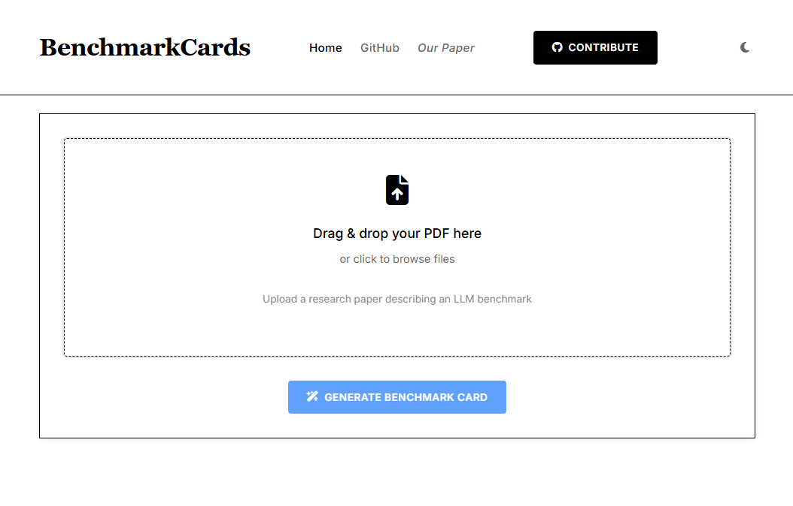

<div id="top">

<!-- HEADER STYLE: CLASSIC -->
<div align="center">

# BENCHMARKCARDS

<!-- BADGES -->


</div>
<br/>


BenchmarkCards offer a standardized way to document LLM benchmarks clearly and transparently. Inspired by Model Cards and Datasheets, BenchmarkCards help researchers and practitioners understand exactly what benchmarks test, how they relate to real-world risks, and how to interpret their results responsibly.

**Who is this for?** AI researchers, data scientists, auditors, policymakers, and anyone concerned with responsible AI deployment.

**Paper link:** https://arxiv.org/abs/2410.12974

---
## 🛠️ How to Use this Repository
### 🔗 Key Contents
- 📁 **BenchmarkCards/** – Generated BenchmarkCards in Markdown. Filenames prefixed with ⭐ indicate that the benchmark author reviewed and approved the card.  
- 📁 **BenchmarkCards_JSON/** – JSON versions of the BenchmarkCards for programmatic access.  
- 🖥️ **platform/** – Source code for the upcoming BenchmarkCards Platform.  
- 📸 **screenshots/** – Screenshots illustrating the platform interface.  
- 📋 **BenchmarkCard_Template.md** – A ready‑to‑use template for creating new BenchmarkCards.  
- 📊 **AI_Risk_Atlas.md** – Maps benchmarks to IBM Atlas AI risk categories and associated benchmarks.

## 🙏 Acknowledgments

We gratefully thank all benchmark authors who provided feedback and approval for the BenchmarkCards in this repository. **Benchmarks approved by their original authors are marked with a ⭐ in the filename.** Your collaboration is essential for making LLM evaluation more transparent, accurate, and useful. Thank you!


## 🚧 BenchmarkCards Platform 🚧

We're excited to introduce our new **BenchmarkCards Platform** - an automated tool designed to streamline the process of generating benchmark cards from research papers! 

**Status**: 🏗️ Currently under construction - coming soon!

The platform will allow users to:
- Upload benchmark papers in PDF format
- Automatically extract key information 
- Generate structured BenchmarkCards
- Download cards in JSON format for easy integration

### Preview Screenshots

Here's a sneak peek at what the platform will look like:

**Main Interface**:


**Generated BenchmarkCard Example**:


**Platform Structure:**
- `app.py`: Main application entry point.
- `config.py`: Configuration settings.
- `requirements.txt`: Project dependencies.
- `static/`: Static files (CSS, JS, images).
- `src/`: Core source code modules:
  - `models.py`: Pydantic data models.
  - `pdf_extractor.py`: PDF text extraction functionality.
  - `ai_service.py`: Integration with OpenAI APIs.
  - `templates.py`: HTML templates management.
  - `markdown_converter.py`: Convert content to Markdown.

## ⚙️ Quick Setup Instructions

```bash
# 1. Clone the repository
git clone https://github.com/SokolAnn/BenchmarkCards.git
cd BenchmarkCards

# 2. Set up your environment
pip install -r requirements.txt

# 3. Add your API key
# Open the config.py file and replace the placeholder with your OpenAI API key
# Example:
# OPENAI_API_KEY = "your-openai-api-key-here"

# 4. Run the app
python app.py

# 5. Access the app
# Open your browser and go to:
# http://localhost:8000/

```
---
## Citation
If you use this work in your research, please cite:
```bibtex
@misc{sokol2025benchmarkcardsstandardizeddocumentationlarge,
      title={BenchmarkCards: Standardized Documentation for Large Language Model Benchmarks}, 
      author={Anna Sokol and Elizabeth Daly and Michael Hind and David Piorkowski and Xiangliang Zhang and Nuno Moniz and Nitesh Chawla},
      year={2025},
      eprint={2410.12974},
      archivePrefix={arXiv},
      primaryClass={cs.CL},
      url={https://arxiv.org/abs/2410.12974}, 
}
```
---
## 🤝 Get Involved!
Would you be interested in contributing to the BenchmarkCards initiative? Feel free to explore, fork the repository, and open issues to suggest improvements or new benchmarks. Let's collaborate and shape the future of LLM benchmarking!

---
## 📄 License
All source code in this repository is licensed under the [MIT License](LICENSE).  
BenchmarkCard content (Markdown and JSON files) is licensed under the [Creative Commons Attribution 4.0 International License (CC BY 4.0)](https://creativecommons.org/licenses/by/4.0/).


