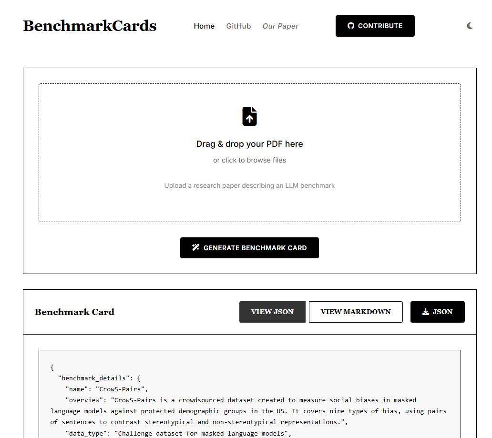

# BenchmarkCards: Large Language Model and Risk Reporting 


BenchmarkCards offer a standardized way to document LLM benchmarks clearly and transparently. Inspired by Model Cards and Datasheets, BenchmarkCards help researchers and practitioners understand exactly what benchmarks test, how they relate to real-world risks, and how to interpret their results responsibly.

Who is this for? AI researchers, data scientists, auditors, policymakers, and anyone concerned with responsible AI deployment.

Paper link: https://arxiv.org/abs/2410.12974

---
## 🛠️ How to Use this Repository
### 🔗 Key Contents
- 📋 **BenchmarkCard_Template.md**: A handy template for creating your very own BenchmarkCard for LLM documentation. 
- ⚖️ **ComparisonBenchmarks.md**: Curious about different benchmarks? This document provides examples of benchmarks used for evaluating risks in LLMs. It doesn't compare them directly but instead illustrates diverse benchmarks to help you understand their various purposes and contexts of use. 
- 🗂 **Benchmarks_and_Risk_Table.md**: A detailed table with benchmarks found in literature, including key references.
- 🌐 **Benchmark_Network.md**:  A visual network that shows how benchmarks connect and relate, especially when it comes to evaluating LLM risks.

## 🚧 BenchmarkCards Platform 🚧

We're excited to introduce our new **BenchmarkCards Platform** - an automated tool designed to streamline the process of generating benchmark cards from research papers! 

**Status**: 🏗️ Currently under construction - coming soon!

The platform will allow users to:
- Upload benchmark papers in PDF format
- Automatically extract key information 
- Generate structured BenchmarkCards
- Download cards in JSON format for easy integration

### Preview Screenshots

Here's a sneak peek at what the platform will look like:

**Main Interface**:


**Generated BenchmarkCard Example**:


**Platform Structure:**
- `app.py`: Main application entry point.
- `config.py`: Configuration settings.
- `requirements.txt`: Project dependencies.
- `static/`: Static files (CSS, JS, images).
- `src/`: Core source code modules:
  - `models.py`: Pydantic data models.
  - `pdf_extractor.py`: PDF text extraction functionality.
  - `ai_service.py`: Integration with OpenAI APIs.
  - `templates.py`: HTML templates management.
  - `markdown_converter.py`: Convert content to Markdown.

## ⚙️ Quick Setup Instructions

```bash
# 1. Clone the repository
git clone https://github.com/SokolAnn/BenchmarkCards.git
cd BenchmarkCards

# 2. Set up your environment
pip install -r requirements.txt

# 3. Add your API key
# Open the config.py file and replace the placeholder with your OpenAI API key
# Example:
# OPENAI_API_KEY = "your-openai-api-key-here"

# 4. Run the app
python app.py

# 5. Access the app
# Open your browser and go to:
# http://localhost:8000/

```
---
## Citation
If you use this work in your research, please cite:
```bibtex
@misc{sokol2024benchmarkcardslargelanguagemodel,
      title={BenchmarkCards: Large Language Model and Risk Reporting}, 
      author={Anna Sokol and Nuno Moniz and Elizabeth Daly and Michael Hind and Nitesh Chawla},
      year={2024},
      eprint={2410.12974},
      archivePrefix={arXiv},
      primaryClass={cs.CL},
      url={https://arxiv.org/abs/2410.12974}, 
}
```
---
## 🤝 **Get Involved!**
Would you be interested in contributing to the BenchmarkCards initiative? Feel free to explore, fork the repository, and open issues to suggest improvements or new benchmarks. Let's collaborate and shape the future of LLM benchmarking!

Edited locally on 2025-04-21.

